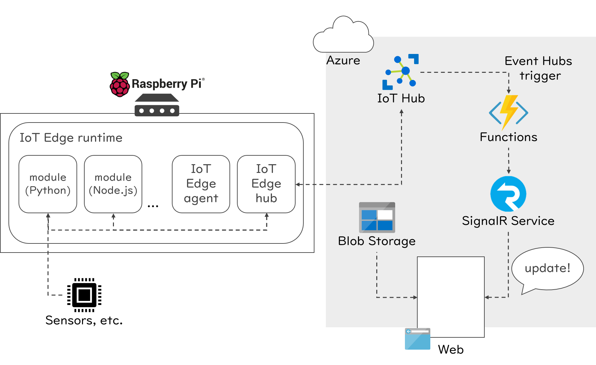

# IoT Edge with serverless application demonstration

[](https://dev.azure.com/nico-playground/iot-edge-with-serverless-demo/_build/latest?definitionId=3&branchName=master)

## Purpose

This project purpose is to make a demonstration that is a combination of Azure IoT Edge and serverless architecture like Azure Functions, Azure SignalR Service and static website hosting feature in Azure Storage.

## Overview



### Technical components

| Components | Description |
|------------|-------------|
| Azure IoT Hub and IoT Edge | Implement module that run on device and manage device status as twins |
| Azure Functions | Relay message from IoT Hub to SignalR Service |
| Azure SignalR Service | Send real-time trigger to a static web application |
| Azure Storage | Host a static web application |
| Azure DevOps | Manage tasks and perform CI/CD |

## Preparation

To deploy resources and provision them in this project, use Azure CLI usually.

If you do not have it, prepare the environment.

- [Overview of the Azure CLI \| Microsoft Docs](https://docs.microsoft.com/en-us/cli/azure/?view=azure-cli-latest)

Then make your `.env` file with copying `.env.sample`, rename it to `.env` and update for your environment.

```bash
# Load .env
source .env

# Login to your Azure account
az login
```

## Deployment

You can deploy with using _Deploy to Azure button_ or using Azure CLI.

### Deploy with "Deploy to Azure button" easily

Click the button below, fill fields and deploy. :)

[](https://deploy.azure.com/?repository=https://github.com/dzeyelid/iot-edge-with-serverless-demo?ptmpl=parameters.azuredeploy.json)

_Attention_: With this way, you cannot use `.env`’s parameters. So fill them into the form manually.

### Deploy with Azure CLI

Deploy resources with using Azure CLI.

```bash
# Create a resource group
az group create \
    --name ${RESOURCE_GROUP} \
    --location ${LOCATION}

# Get latest release (requires jq command)
FUNCTIONS_ZIP_URL=$(curl https://api.github.com/repos/dzeyelid/iot-edge-with-serverless-demo/releases/latest | jq -r '.assets[0].browser_download_url')

# Deploy resources with ARM template
az group deployment create \
  --resource-group ${RESOURCE_GROUP} \
  --template-file azuredeploy.json \
  --parameters @parameters.azuredeploy.json \
  --parameters projectName=${PROJECT_NAME} \
  --parameters functionsZipUrl=${FUNCTIONS_ZIP_URL}
```

## Provisioning

First, you have to set the service mode of Azure SignalR Service like below.

1. Open the Azure SignalR Service blade on Azure Portal
1. Go to _Settings_ blade and switch the _Service Mode (PREVIEW)_ on _Feature Flags_ to `Serverless`.

Then, do below.

```bash
# Provision Storage Accounts to enable static website hosting
az extension add --name storage-preview
STORAGE_NAME=$(az storage account list \
    --resource-group ${RESOURCE_GROUP} \
    --query "[0].name" \
    --output tsv)

az storage blob service-properties update \
    --account-name ${STORAGE_NAME} \
    --static-website \
    --index-document index.html

# Provision each resources

# Hold project root path
PROJECT_ROOT=$(pwd)

# Deploy static web application
cd src/static-web-app
yarn build
az storage blob upload-batch \
    --source dist \
    --destination \$web \
    --account-name ${STORAGE_NAME}

# Show the url of static web application
az storage account show \
    --name ${STORAGE_NAME} \
    --resource-group ${RESOURCE_GROUP} \
    --query "primaryEndpoints.web" \
    --output tsv

# Return to project root directory
cd ${PROJECT_ROOT}
```

## References

### About copyrights

- [Download Microsoft Azure, Cloud and Enterprise Symbol / Icon Set - Visio stencil, PowerPoint, PNG, SVG from Official Microsoft Download Center](https://www.microsoft.com/en-us/download/details.aspx?id=41937)
- [Trademark rules and brand guidelines - Raspberry Pi](https://www.raspberrypi.org/trademark-rules/)

## Licenses

© 2019 Kazumi OHIRA (@dzeyelid) All rights reserved.

本コンテンツの著作権、および本コンテンツ中に出てくる商標権、団体名、ロゴ、製品、サービスなどはそれぞれ、各権利保有者に帰属します